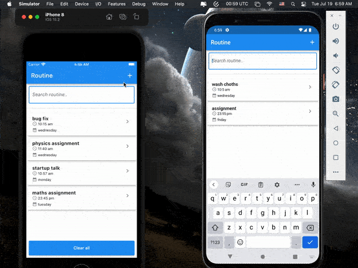

&nbsp;&nbsp;
&nbsp;&nbsp;
<a href="https://choosealicense.com/licenses/mit/" target="_blank"></a>&nbsp;&nbsp;
&nbsp;&nbsp;


# Isar CRUD - [YouTube](https://www.youtube.com/watch?v=j3UeWbIfXL4&list=PLKKf8l1ne4_hMBtRykh9GCC4MMyteUTyf&index=1) 

</img>

Isar is a No-SQL relational database for Flutter a application. I am using an [YouTube](https://www.youtube.com/watch?v=j3UeWbIfXL4&list=PLKKf8l1ne4_hMBtRykh9GCC4MMyteUTyf&index=1) tutorial for this project. In this tutorial we will learn the following topics:

```dart
    1. Collections
    2. Indexes
    3. CRUD
    4. Queries
    5. Full-text search
    6. Transactions
    7. Watches
    8. Schema & Collection
```

## pubspec.yaml

```yaml
dependencies:
  isar: ^2.5.0
  # contains the binaries (not required for web)
  isar_flutter_libs: ^2.5.0
  # For providing the storage path
  path_provider: ^2.0.11

dev_dependencies:
  isar_generator: ^2.5.0
  build_runner: ^2.2.0
```

Command to execute build runner:

```shell
 $ flutter pub run build_runner build
```

## App Demo

<p align="center"></p>

## Isar CRUD

Create: [create_routine_page.dart](lib/app/pages/create_routine_page.dart)

```dart
  addRoutine() async {
    final routineCollection = widget.isar.routines;
    final newRoutine = Routine()
      ..title = _titleController.text
      ..startTimeRoutine = _timeController.text
      ..day = dropdownDay
      ..category.value = dropdownValue;

    await widget.isar.writeTxn((isar) async {
      await routineCollection.put(newRoutine);
    });

    _titleController.clear();
    _timeController.clear();
    dropdownDay = 'monday';
    dropdownValue = null;

    // SnackBar for notifying the user
    final snackBar = SnackBar(
      content: Text('${_titleController.text.toString()} added!'),
      action: SnackBarAction(
        label: 'ok',
        onPressed: () => Navigator.pop(context),
      ),
    );
    ScaffoldMessenger.of(context).showSnackBar(snackBar);
  }
```

Read: [home_page.dart](lib/app/pages/home_page.dart)

```dart
  _readRoutines() async {
    final routineCollection = widget.isar.routines;
    final getRoutines = await routineCollection.where().findAll();

    setState(() {
      routines = getRoutines;
      isLoading = false;
    });
    // print(routines![0].title);
    // print(routines![0].startTimeRoutine);
    // print(routines!.length);
  }
```

Update: [update_routine_page.dart](lib/app/pages/update_routine_page.dart)

```dart
  updateRoutine() async {
    final routineCollection = widget.isar.routines;
    await widget.isar.writeTxn((isar) async {
      final routine = await routineCollection.get(widget.routine.id);

      routine!
        ..title = _titleController.text
        ..startTimeRoutine = _timeController.text
        ..day = dropdownDay
        ..category.value = dropdownValue;

      await routineCollection.put(routine);

      Navigator.pop(context);
    });
  }
```

Delete: [update_routine_page.dart](lib/app/pages/update_routine_page.dart)

```dart
  deleteRoutine() async {
    final routineCollection = widget.isar.routines;

    await widget.isar.writeTxn((isar) async {
      routineCollection.delete(widget.routine.id);
    });

    Navigator.push(
      context,
      MaterialPageRoute(builder: (context) => HomePage(isar: widget.isar)),
    );
  }
```

## Searching
```dart
  searchRoutineByName(String searchName) async {
    searching = true;
    final routineCollection = widget.isar.routines;
    final searchResults =
        await routineCollection.filter().titleContains(searchName).findAll();

    setState(() {
      routines = searchResults;
      isLoading = false;
    });
  } 
```

## Handling Transaction
A transaction is a set of operations, or a set of  statements that are executed as a unit together. In short, it will involve more than one operation.

```dart
  clearAll() async {
    final routineCollection = widget.isar.routines;
    final getRoutines = await routineCollection.where().findAll();

    await widget.isar.writeTxn((isar) async {
      for (var routine in getRoutines) {
        routineCollection.delete(routine.id);
      }
    });
    setState(() {});
  }
```

## File Pattern Inside The `lib` Folder

```
lib/
├── app/
│   ├── collections/
│   │   ├── category.dart
│   │   ├── category.g.dart
│   │   ├── routine.dart
│   │   └── routine.g.dart
│   └── pages/
│       ├── create_routine_page.dart
│       ├── home_page.dart
│       └── update_routine_page.dart
└── main.dart
```
