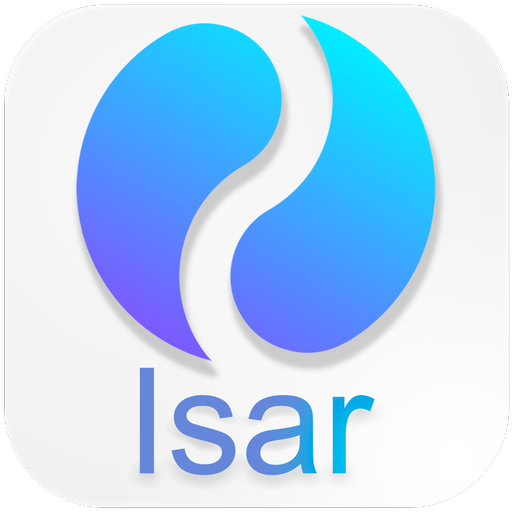

&nbsp;&nbsp;
&nbsp;&nbsp;
<a href="https://choosealicense.com/licenses/mit/" target="_blank"></a>&nbsp;&nbsp;
&nbsp;&nbsp;


# Isar CRUD

</img>

Isar is a No-SQL relational database for Flutter a application. I am using an [YouTube](https://www.youtube.com/watch?v=j3UeWbIfXL4&list=PLKKf8l1ne4_hMBtRykh9GCC4MMyteUTyf&index=1) tutorial for this project. In this tutorial we will learn the following topics:

```dart
    1. Collections
    2. Indexes
    3. CRUD
    4. Queries
    5. Full-text search
    6. Transactions
    7. Watches
    8. Schema & Collection
```

## pubspec.yaml

```yaml
dependencies:
  isar: ^2.5.0
  # contains the binaries (not required for web)
  isar_flutter_libs: ^2.5.0
  # For providing the storage path
  path_provider: ^2.0.11

dev_dependencies:
  isar_generator: ^2.5.0
  build_runner: ^2.2.0
```

Command to execute build runner:

```shell
 $ flutter pub run build_runner build
```

## Isar Inspector

<p align="center"></p>
